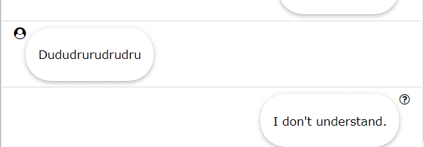
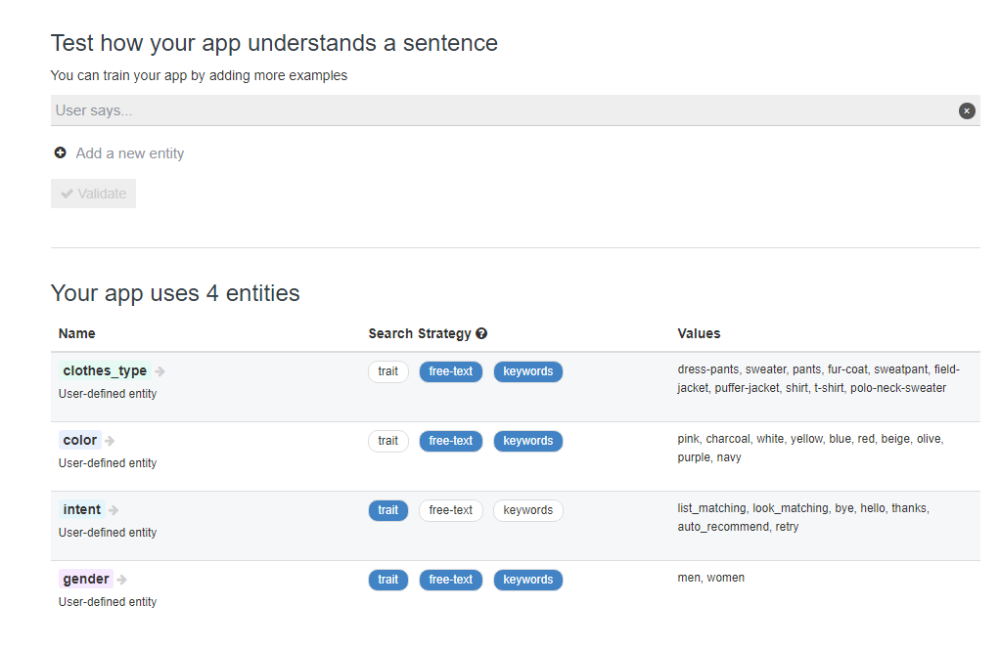

## Wit.ai를 이용한 간단한 Dialogue System 만들기

### 개요

Wit.ai 서비스는 대화 시스템에서 자연어의 이해 부분을 담당한다. 유저
입력을 이용해서 자연어 이해 모델을 쉽게 만들 수 있다. 프로젝트에서는
Wit.ai와 nodejs를 이용해서 간단한 규칙 기반의 대화 시스템을 구현해보았다. 대화
매니저와 슬롯 형태의 대화 토막을 이용해서 질문에 따라 의류에 대한 추천을 받을 수 있으며 간단한 인사가 가능하다. 시간 관계상 남성 의류 위주의 데이터만 추가했기 때문에 여성 의류의 작동은 보장할 수 없다.

  
   figure 1. DialogueManager 처리 과정
  

### 구현 및 알고리즘

클라이언트로 브라우저에서 이용할 수 있는 간단한 대화 UI를 가진
웹사이트를 제작하였다. socket.io 모듈을 이용해서 실시간으로 서버와
정보를 주고받을 수 있다. Wit.ai의 결과를 message 형태로 받아서 직접
처리하였다. 서버에는 좀 더 범용적이고 확장 가능한 대화 시스템을 만들기
위해 특정 주제를 가지는 Dialogue라는 개념을 만들었다. 각 Dialogue마다 요구되는 입력값이 있고 입력값의 존재 여부에 따라 답변을 생성하여 반환한다. 즉, 쉽게 말해 슬롯 형태로 작동한다. 이번 과제에서는 의류 추천에 관한 클래스인 RecommendDialogue 클래스와 매우 간단한 인사를 위한 CasualDialogue 클래스를 만들어서 테스트해보았다. RecommendDialogue의 경우 유저의 의도, 옷 종류, 색상, 성별 이 네 가지 정보를 모두 알아야만 제대로 된 답변을 생성하여 대화를 완성할 수 있다 (해당 정보를 이용해서 Web Scraping을 시도한다). Dialogue를 관리하는 DialogueManager 클래스에서는 유저 입력이 도착했을 때 필요한 정보를 지식으로 저장한 뒤 유저 입력에 따라 Dialogue를 활성화한다, 저장된 정보는 지속한다. 활성화된 Dialogue에 대해서 답변을 처리한 뒤 조건이 만족할 경우 대화를 비활성화한다. 기본적으로 이 대화 시스템에서는 기계와 유저가 차례를 번 갈아가며 작동한다.

### 대화 예시

다음의 대화 예시를 통해서 어떤 식으로 구축되어 있는지 더 자세히 확인할 수 있다.

  
   event 1. 간단한 인사
  

CasualDialogue는 매우 간단하게 작성되었다. Hello, Bye, Thanks 세가지 Intent에 대해서만 응답하며, 짧은 텍스트기반 답변이기도 하고 슬롯도 필요가 없기 때문에 곧바로 비활성화된다.

  
   event 2. 흰 남성용 티셔츠를 사고 싶어
  

흰 남성용 티셔츠를 사고 싶어서 물어본 상황이다. RecommendDialogue가
필요한 모든 정보가 유저에 의해 단번에 주어졌기 때문에 바로 사진을 통해
추천을 받은 모습이다. 해당 사진을 클릭할 시에 구입가능한 웹사이트로
연결된다.

  
   event 3. 파란 셔츠를 어떻게 입는게 좋을까?
 

파란 셔츠를 어떻게 입으면 좋을지 도움을 받는 상황이다. 유저가 파랑 셔츠와 같이 입을만한 것이 뭐가 있겠냐고 묻자 성별에 대한 정보가 없기 때문에 남성용 의류를 찾는지 여성용 의류를 찾는지 질문으로 대답한다. 유저가 남성용이라고 말하자 파란 셔츠가 포함된 패션 사진이 답변으로 돌아왔다. 사진을 클릭하면 사진에 포함된 옷들의 정보가 있는 웹사이트로 연결된다.

  
   event 4. 남성용 가디건을 사고싶은데?
 

남성용 카디건을 사려는 상황이다. 남성용 카디건을 사고 싶다고 말하자 어떤 색의 카디건을 원하는지 되묻고 있다. 그 후에 유저가 분홍색이라고 답하자 관련 사진이 답변으로 돌아왔다. 역시 사진을 클릭하면 관련 사이트로 이동한다.

  
   event 5. 이어지는 대화. 그건 좀 맘에 안드는데?
 

답변을 받았으나 다른 결과를 원하는 상황이다. ‘다른 옷이 있냐’고 묻자
다른 사진으로 답변이 돌아왔다. 이 경우 Retry라는 Intent를 사용하는데
DialogueManager에서 Retry를 입력받게 되면 가장 최근에 완료되었던
Dialogue를 재활성화시킨다. DialogueManager에 정보가 그대로 저장되어
있기 때문에 유저에게 필요한 정보를 다시 얻어 낼 필요가 없다.

  
   event 6. 이어지는 대화. 그럼 남색 코트랑 어울리는 옷은 뭐야?
 

이전의 대화는 원하는 의류 상품을 추천 받는 상황이었고 이번에는 남색
코트와 어울리게 입는 법을 추천 받는 상황이다. ‘남성용’이라고 명시하지
않았음에도 불구하고 DialogueManager가 유저의 성별을 기억하고 바로 결과를 찾아준 것이 잘 나타나 있다. 여기서 ‘I want something else’와 같은 Retry Intent를 가진 문장을 입력 받는다면 남색 코트와 어울리는 또 다른 룩을 보여줄 것이다.

  
   event 7. 고마워
 

아까 말했듯이 간단한 인사형 답변이 가능하다.

  
   event 8. 예외 상황
 

DialogueManager가 알 수 없는 대화 형식이거나, Wit.ai에서 이해하지 못하는 문장의 경우 다음과 같이 이해할 수 없다는 문구가 표시된다. 추가적으로 사진을 가져오는 과정에서 사진을 찾지 못한다거나 기타 오류가 생기면 무언가 잘못되었다는 답변이 돌아온다.

### 결과 및 피드백

좀 더 범용적으로 구현하려 했으나 여러가지 제약 때문에 완성도가 매우 떨어지게 되었다. 유저에게 입력 받은 정보를 임시정보, 사적인 정보로 나누어서 다르게 처리하는 것도 포함시키려 했으나 하지 않았고 Dialogue 클래스가 두개 밖에 없기 때문에 간단히 상황에 맞게 정보를 업데이트 하도록 하였다. 여러 Dialogue가 동시에 진행될 경우 하나에 대한 답변만 제공된다. 이 부분은 우선순위를 통해서 해결할 수 있으나 현재는 단순히 받아온 답변의 배열 중 가장 첫 번째 것을 반환하게 되어있다. 처음에는 Wit.ai에서 제공하는 Story를 이용해서 대화의 흐름을 만들어보려 했으나 Beta여서 그런지 Story를 삭제 추가하는 과정에서 무언가 꼬여서 완전히 고장나 버려서 직접 작성하게 되었다. Wit.ai 자체의 데이터 업데이트가 느려서 데이터가 꼬이는 일이 빈번하게 일어난다. 삭제된 entity가 지속해서 나타나는 버그가 있었다. Wit.ai에 여러 색상과 의류를 직접 기입하여 두었으나 예제를 통해 모두 학습시키지는 않았기 때문에 인식하지 못할 수 있다.

  
   figure 2. Wit.ai entity 작성 페이지
 

### misc

[Wit.ai 주소](https://wit.ai/mgcoder/NLP_clothes_rec/entities)

**소스코드 실행방법**

명령어 프롬프트 창에서 **node index.js** 로 실행한 뒤 브라우저에서
**localhost:8080**로 접속한다.

**Web Scraping한 웹사이트**

[*https://lookastic.com/*](https://lookastic.com/) 이라는 의류 추천 사이트를 이용하였다. 사진에 대한 저작권은 모두 상기 사이트에 있다.
